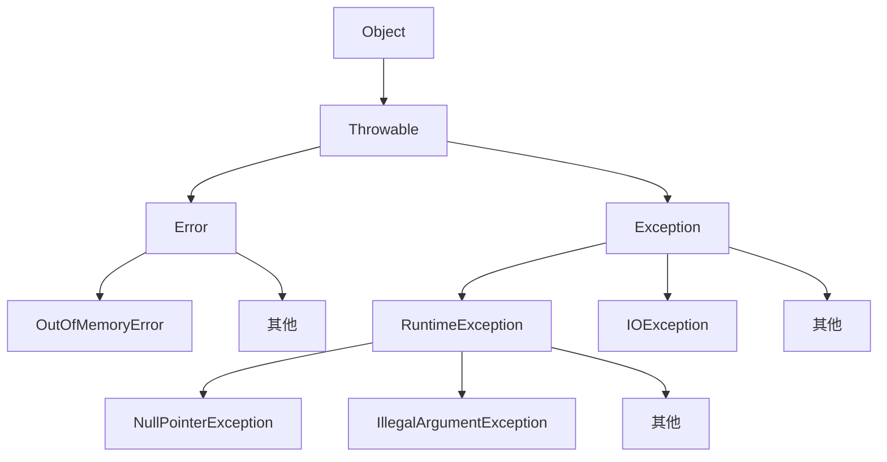

异常是`class`，继承树如下所示：


- `try`代码块从一条产生问题的代码开始直接进入定义的`catch`类，后面的就不会执行 *指的是`try`block后面的内容，跳出try..catch语句后还是会正常执行的* **`finally`语句无论try有没有捕获到异常都会执行**
- 如果当前方法没有捕获异常，异常就会被**抛到**上层调用方法，直到遇到某个`try ... catch`被捕获为止，例子如下

```java
    public class Demo {

        public static void main(String[] args) {
            System.out.println("main 开始执行");
            methodA();   // <-- methodA 抛出异常，但 main 没有捕获
            System.out.println("main 结束执行"); // 永远不会执行
        }

        static void methodA() {
            System.out.println("进入 methodA");
            methodB();  // <-- 异常继续往上抛
            System.out.println("退出 methodA"); // 永远不会执行
        }

        static void methodB() {
            System.out.println("进入 methodB");
            int x = 10 / 0;  // <-- 这里抛出 ArithmeticException
            System.out.println("退出 methodB"); // 永远不会执行
        }
    }

```
在这个代码块中，最后的输出是这样的：
```
main 开始执行
进入 methodA
进入 methodB
Exception in thread "main" java.lang.ArithmeticException: / by zero
    at Demo.methodB(Demo.java:17)
    at Demo.methodA(Demo.java:11)
    at Demo.main(Demo.java:5)
```
程序是被down掉而非 ==优雅地==结束
- **检查性异常** `CheckedException`，这个是可恢复异常，就是在编译期间JVM可以直接把是错误甩锅给你本身的异常，正常情况下你在相关有intellisense的IDE里就会直接提示爆红了，要是强行编译就会抛出这类型的异常，比如说NoSuchMethodException，FileNotFoundException等等

- **非检查性异常** 我们现在学的基本全是这种异常，包括并不继承于`Exception`的`Error`
### try catch具体处理
首先考虑无`throw`的情况：
```java
try {
    String s = null;
    s.length();  // NullPointerException
} catch (RuntimeException e) {       // ❌ 父类
    System.out.println("Runtime 捕获");
} catch (NullPointerException e) {   // ❌ 子类永远到不了
    System.out.println("NPE 捕获");
}

```
这个代码块首先展示了catch是有**先后顺序**的，越继承后端的子类最好写在catch的前面
**注意：！** 虽然java7中加了catch（xxe | xxe）{}能用同一套语句去处理异常，但这个多捕获绝对不能是父类子类的关系！

#### 考虑到throw
这个主要是考虑到底层方法处理异常的流程，因为你想嘛，catch了以后这个try就结束了，这个实在是太简单粗暴了。很多时候产生它的方法其实 **没资格** 或 **没能力** 处理，你在方法里面trycatch一下，反应到实际程序中，如果方法里真的捕获到了异常，你的catch又写得及其简单（比如说只打印一下），最后的结果就个异常 **被吃了**！，调用者根本不知道出错了，一般而言，如果你认为一个方法会产生异常，那么最好的方法是利用`thorws`的声明：

```java
// 读文件的底层方法
public void readConfig() throws FileNotFoundException {
    FileInputStream fis = new FileInputStream("config.txt");
}
public void startSystem() {
    try {
        readConfig();
    } catch (FileNotFoundException e) {
        System.out.println("配置文件丢失，正在创建默认配置...");
        createDefaultConfig();
    }
}

```
==底层只负责抛出，上层负责具体应对== （其实很像godot里的信号）
这里你可以看到，虽然方法里有写`throws`但是语句中并没有`throw`，这个是由JVM自动产生的，用了官方库的类别人高级开发师已经预想到这种情况了，但是你的自定义异常，基本上只能手动抛
`throw`相当于`return`，如果执行到`throw`
- 当前方法立刻终止，不再执行后面的代码
- 方法直接“向上返回”一个异常对象
`throws`也不能少写东西，如果一个方法出现异常已经抛出一个异常类，那么他被抛出的每一个路径都得写上throws，一直抛到main里，直到找到某个调用父块中可以找到对应的`trycatch`


