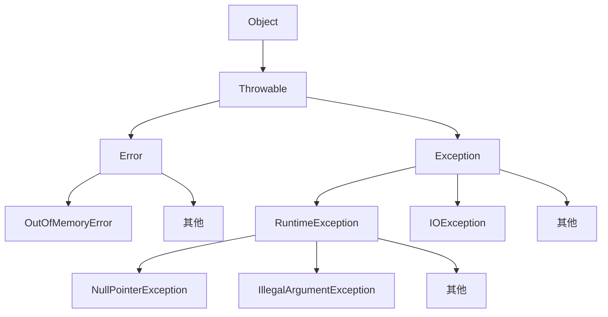

异常是`class`，继承树如下所示：

```mermaid
graph TD
    Object --> Throwable
    Throwable --> Error
    Throwable --> Exception
    Error --> OutOfMemoryError
    Error --> Other_Errors["其他"]
    Exception --> RuntimeException
    Exception --> IOException
    Exception --> Other_Exceptions["其他"]
    RuntimeException --> NullPointerException
    RuntimeException --> IllegalArgumentException
    RuntimeException --> Other_RuntimeExceptions["其他"]
```
- `try`代码块从一条产生问题的代码开始直接进入定义的`catch`类，后面的就不会执行
- 如果当前方法没有捕获异常，异常就会被抛到上层调用方法，直到遇到某个`try ... catch`被捕获为止：