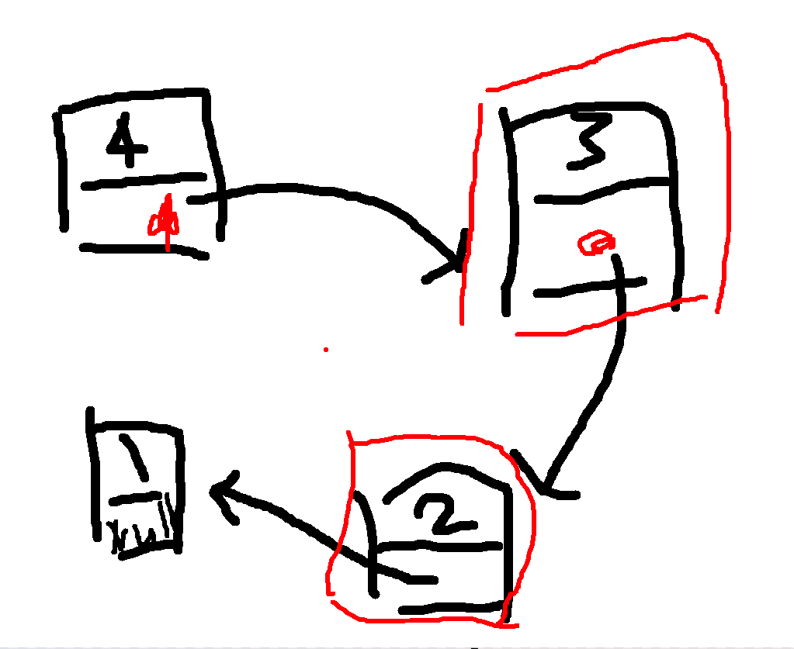

## 顺序表（一维数组）的插入与删除
先定义一个简单数组方便演示
```c
int a[10] = {0,1,2,3,4}; 
int length = 5;
```
现在，我们想插入一个`5`到这个数组的任意位置上

#### 尾部插入
如果放到尾巴，那就太简单了，其他数据完全不需要动
```c
a[5] = 5;
length ++;
```
#### 头部插入&中间循环
稍微有点麻烦一些，因为数组里面的数都挺死板的，你要在`a[0]`处放上5的话，原本的0可不会挪动位置，会直接被你盖住了，所以你得写个循环，让该插入的位置右边所有人都右移一小格
```c
int newindex = 0;
//int newindex = 3; 中间插入就用这个
for(int i = length - 1; i >= index; i--){
    a[i+1] = a[i]
}
a[index] = 5;
newlength++;
```

#### 一些整合的思想
综合我们结构体学习的内容，我们很容易发现，这个`length`和数组总是绑定在一起的，所以，我们可以尝试用结构体整合一下，然后再把这三个插入整合成一个，~~这样就能成为黄箐所设想的优秀的架构师了（x~~

示例代码：
```c
#include<stdio.h>

int i;

typedef struct{
    int a[10];
    int l;
}array;

void insert(array* a, int pos, int v){
    for(i = a->l - 1;  i >= pos; i--){
        a->a[i+1] = a->a[i];
    }
    a->a[pos] = v;
    a->l++;
}

```

#### 删除
跟增添的操作特别像，甚至都不用赋值了，只用移位覆盖了，直接根据上面整合的内容再写个函数吧
```c
#include<stdio.h>

int i;

typedef struct{
    int a[10];
    int l;
}array;

void del(array* a, int pos){
    for(i = pos; i < a->l - 1; i++){
        a->a[i] = a->a[i+1];
    }
    a->l--;
}
```

### 扩容
我们发现，数组为了能够 **实现数据在物理内存的连续化**，往往需要事先规划，但是遇到规划量比所要存储数据要小很多时，则会出现错误，所以，我们要么换一种数据的存储方式，要么就执行一种**动态的扩容机制**, C语言的`stdlib.h`库就提供了一种及其好用的动态扩容函数
#### malloc
~~感觉这个自己已经理解的差不多了，偷个GPT解释偷懒一下，毕竟下面还有更大头打算理解~~
C 语言中的 `malloc` 函数家族用于**动态内存分配**，在程序运行时向**堆内存**申请一块指定大小的内存。这些函数在 `<stdlib.h>` 头文件中定义。以下是常见的函数及其作用：


##### 1. **`malloc`（memory allocation）**
- **语法**：`void* malloc(size_t size);`
- **功能**：分配**指定大小的内存**（以字节为单位），但**不会初始化内存内容**。
- **返回值**：返回指向已分配内存的**指针**（类型为 `void*`，需要转换为合适的类型）。
- **常见用法**：
  ```c
  int *arr = (int *)malloc(10 * sizeof(int));  // 为10个int类型的元素分配内存
  if (arr == NULL) {
      printf("内存分配失败\n");
  }
  ```

---

##### 2. **`calloc`（contiguous allocation）**
- **语法**：`void* calloc(size_t num, size_t size);`
- **功能**：分配**num个元素，每个元素大小为size**的连续内存块，**并将所有内存内容初始化为0**。
- **返回值**：返回指向已分配内存的**指针**（类型为 `void*`，需要转换为合适的类型）。
- **与`malloc`的区别**：
  - `malloc` 不初始化内存，`calloc` 会将分配的每一位都清零。
- **常见用法**：
  ```c
  int *arr = (int *)calloc(10, sizeof(int));  // 分配10个int类型的内存，并全部初始化为0
  if (arr == NULL) {
      printf("内存分配失败\n");
  }
  ```

---

##### 3. **`realloc`（reallocation）**
- **语法**：`void* realloc(void* ptr, size_t size);`
- **功能**：调整**已经分配的内存大小**，如果新大小大于原大小，则新分配的内存**不会被初始化**。
- **返回值**：返回调整后新分配的内存块的**指针**。
- **常见用法**：
  ```c
  int *arr = (int *)malloc(5 * sizeof(int));  // 分配5个int大小的内存
  arr = (int *)realloc(arr, 10 * sizeof(int)); // 重新分配成10个int的大小
  if (arr == NULL) {
      printf("内存分配失败\n");
  }
  ```

---

##### 4. **`free`（释放内存）**
- **语法**：`void free(void *ptr);`
- **功能**：释放**malloc**、**calloc** 和 **realloc** 分配的内存，释放的内存可以重新被分配。
- **返回值**：无返回值。
- **常见用法**：
  ```c
  int *arr = (int *)malloc(10 * sizeof(int));
  free(arr);  // 释放内存
  arr = NULL; // 避免“悬空指针”问题
  ```

---

##### **对比总结**
| 函数    | 内存分配 | 是否初始化  | 使用场景                   |
|---------|----------|------------|--------------------------|
| **`malloc`** | 分配 `size` 字节 | **否** | 仅需要分配内存，不需初始化 |
| **`calloc`** | 分配 `num * size` 字节 | **是（全 0）** | 需要初始化的数组或结构体  |
| **`realloc`** | 重新调整内存块大小 | **否** | 动态调整已分配的内存大小   |
| **`free`** | 释放 `malloc`、`calloc` 或 `realloc` 的内存 | 不适用 | 释放动态分配的内存         |

---

##### **注意事项**
1. **内存泄漏**：`malloc`、`calloc`、`realloc` 申请的内存必须使用 `free` 释放，否则会内存泄漏。
2. **空指针检查**：每次使用 `malloc`、`calloc`、`realloc` 后，应该检查返回的指针是否为 `NULL`。
3. **悬空指针**：`free` 释放的指针应赋值为 `NULL`，否则会成为悬空指针，指向一块**无效的内存地址**。
4. **未初始化的内存**：`malloc` 和 `realloc` 申请的内存内容是未定义的，`calloc` 分配的内存为**全 0**。
5. **内存对齐**：C语言中的 `malloc`、`calloc` 通常分配的内存是**对齐的**，有利于提高访问速度。


---


## 链表
**顺序表** 的空间连续，确实是一个很好的结构，非常方便查找，搜索，调用。但从上面的学习我们可以知道，这个确实是不方便插入和删除。所以我们另想出了一个新的结构

>我们在广泛浩瀚的虚拟内存空间里面，离散着分布着五个数字，我们之前学过指针数组，发现它能够把离散的数组给"连续"起来，那这种方法为什么不可以用在单个数据呢？

用一张图简单解释一下这个思想！

我们发现了，这需要一个 **特殊** 的数据类型，需要 **同时** 存储数据和 **下一个数据的地址**，这种**相互依赖**的数据类型，我们很容易想到用 **结构体**来解决~~其实上一个顺序表也是这样写的~~，这样，也能非常轻而易举地写出一个遍历代码：

```c
#include<stdio.h>

typedef struct{
    int data;
    int* next;
}node;

int main(){
node n0 = {0,NULL};
node n1 = {1，NULL};
node n2 = {2,NULL};

n0.next = &n1;
n1.next = &n2;

node* p = &n0;
while(p != NULL){
    printf("%d ",p -> data);
    p = p->next;
}
}
```

但这时候我们又会想了，这种形式的遍历，会不会效率太慢了？每次都要等那个结构体把所有数据的地址都存储起来，在进行互相指，这样光定义和遍历就落后数组太多了

我们就想着，是否能够新建两个命名分别为`head`与`tail`，数据类型依然是`node*`的指针，让`tail`在初始化节点的时候进行“平移”，这样就能够进行指针的移动。**这样就能实现，在下个结点创造的那一瞬间，让上一结点的地址数据指向下一节点**，这种方法就叫做
#### tail&head法创建单链表节点群
随着新节点的创建，`tail`也跟着移动，我们这时候突然又一思考，这个`tail`和`head`指针，好像又是一个相辅相成的变量？我们也能把他们又定义成一个新结构体`nodelist`
示例代码
```c
typedef struct{
    int data;
    node* next;
}node;

typedef struct{
    node* head;
    node* tail;
}nodelist;

node* creatnode(int i){         //定义一个初始化单个节点的子函数，返回值是结构体指针，方便在其他函数中直接改变值。
    node* newnode = (node*)malloc(sizeof(node));
    newnode->data = i;
    newnode->next = NULL;
    return newnode;
}

nodelist createnodelist(int length){
    node* head = NULL;
    node* tail = NULL;
    for(int i = 0; i < length;i++){
        node* newnode = createnode(i);  //一旦函数返回后，该局部变量的内存就会被回收，不再有效。所以在函数外使用这个节点指针就会出现错误（“野指针”）,而通过 malloc 分配的内存则会一直存在，
        if(tail == NULL){
            head = tail = newnode;
        }
        else{
            tail->next = newnode;   //最关键的关键操作，见下解释
            tail = tail->next   //  tail指针往后移动一位，毕竟next成员是一个指针，当然能够互相赋值
        }
    }
    return {head,tail};
}
```
如何实现的？：**最主要要理解的操作是：`tail->next`**，这句话的意思就是，**取出**`tail` 所指节点结构体中的 next 成员。


### 链表插入
#### 在头部插入
#### 在尾部插入
#### 新建指针通过函数中间插入链表元素
方法1：新建两个指针变量，一个用于存新节点前一个结点应该指向的next，一个用于存该新节点的next应该指向的值
方法2：
### 链表删除
删head很容易，
#### 头删除
#### 中&尾删除 
但是删tail比较难，和删中间值一样，主要是指针head向右移动的时候，想要让上一个节点越过被删除的节点指向新的next时，指针已经掠过了前一个元素了，所以得新建两个指针同时步进以方便随时能读取到上一个节点的地址以便访问。最后free掉被删掉结点的指针指向的内存就可以了
#### 尾随法

但我就是不想新建两个指针怎么办？

我他妈不能再链表本身上面做文章吗？谁**规定链表中结点的元素就只能有data和next两个元素的**，我再结构体里面加个`pre`不就行了，这个pre就直接指向前面的节点，这样我就一个指针指到元素不就能如此方便地把前面的元素指向删除的后面的元素了，不用建两个指针像狗交配一样如胶似漆地移动了。还方便维护（主存储器：？），**这就是广义上的双链表产生的过程。**

从这个例子可以看出，**数据结构**实际上就是顺序表加上链表创造出的各种分支，
包括树之类的
